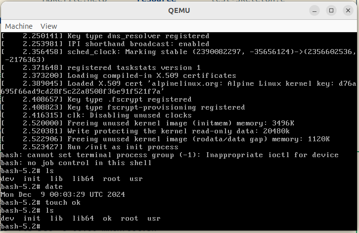

# Minimal build & boot linux kernel + coreutils (via busybox), openssh & iputils

If you're interested in learning how linux boots, want to debug a kernel boot and/or change it's boot arguments and so forth, you'll enjoy this repo.



Goal is to have mimimal but realistic node with network capabilities build in (`ip`) and bootstrapped (similar to [alpine's netbot](https://boot.alpinelinux.org/) ([example](https://github.com/KarmaComputing/server-bootstrap/blob/494089caa2c88bbf37a739aa96561231d5847be5/.github/workflows/build-alpine-netboot-image-zfs.yml#L1))). [Clearlinux](https://github.com/clearlinux/distribution) is interesting. This is using musl (which alpine uses) rather than glibc to support staticaly built binaries more easily.

## The process in a nutshell

- Given a built linux kernel (e.g. `vmlinuz-lts`)
- Clone and build all the various packages you want
- Write an `init` script
- Build all the binaries + `init` script into a initramfs
- Run/boot with qemu
- Rememebr busybox needs to be static build (see .config)
  - <strike>dropbear needs at least a `dropbear_rsa_host_key` key config or will not start see [gist](https://gist.github.com/mad4j/7983719) </strike>
  - Prefering openssh for end user compatability (statically built)

> [!TIP]
> This repo uses [qemu](https://www.qemu.org/download/) to demonstrate the running of the built linux kernel & `initramfs`.
> This repo assumes you have installed and compiled qemu with the `./configure --enable-strip` option to support [SLiRP networking](https://wiki.qemu.org/Documentation/Networking) which the [qemu build instructions](https://www.qemu.org/download/#:~:text=the%20git%20repository!-,Build%20instructions,-To%20download%20and) don't point out to you immediately.
> Qemu is exceptionally versatile, but (for me) easily confusing for it's configuration, and, given it's long history, you'll find lots of out-dates configuration examples.
>
> Otherwise the [official Qemu docs](https://www.qemu.org/documentation/) are actually very good. A lot of effort has been made here to provide acurate working examples, and in some cases video recordings of the steps. As the saying goes, rtfm or, "Literacy is a bridge from misery to hope." - Kofi Annan

## Things you need to build - you'll likely want to start here

You'll probably want to build a kernel, with the utilities claimed in the title of this repo (linux kernel + coreutils (via busybox), openssh & iputils).

See [./build-all.sh](./build-all.sh) to build all those. Effort has been made in that script to make it largely re-producible in the sense that it removes (`rm`) it's artifacts each time, and uses `git checkout <tag>/<commit>` to checkout specific versions of the various utilities.

### How do I extract an `initramfs` / `initrd` gz cpio archive, view it's `init` script and repackage?

> Situation: How do I make a change to the `init` script without going through the whole process of re-building? I've built `initramfs` using [`build-all.sh`](https://github.com/KarmaComputing/minimal-linux-boot-coreutils/blob/c64027b54b12d488f83cef75b5fbfee3d444e661/build-all.sh#L1) but I want to make a quick change to the `init` script (generated in [`create-init.sh`](https://github.com/KarmaComputing/minimal-linux-boot-coreutils/blob/c64027b54b12d488f83cef75b5fbfee3d444e661/create-init.sh#L1), called by [create-scratch-space](https://github.com/KarmaComputing/minimal-linux-boot-coreutils/blob/c64027b54b12d488f83cef75b5fbfee3d444e661/create-scratch-space.sh#L71).

📹 Video demonstration: [debugging Linux Kernel init script initramfs qemu alpine example](https://youtu.be/lpCHsihnV50)

For a faster feedback loop, sometimes you want to speed up debugging your `rootfs.cpio.gz` init script which is inside your (initramfs / initrd) image- which is typically a gzipped, `cpio` archive. The bootloader extracts and loads this `initramfs` / `initrd` filesystem, calling your `init` script first. In this repo example, we [pass](https://github.com/KarmaComputing/minimal-linux-boot-coreutils/blob/c64027b54b12d488f83cef75b5fbfee3d444e661/run-qemu.sh#L5C144-L5C154) `init=/init` to the kernel args. During boot the `init` file
(which is stored in the root (`/`) of the `initramfs` image, is ran first. Distributions can use this to perform initial setup, such as ensuring
a minimal valid linux directory structure (`/dev`, `proc` etc) and handle other boot-time kernel arguments such as `ip=` to set boot time network ip addressing. For example, if you're using  the [_alpine_ distro, their`initramfs``init` file
parses the kernel `ip=` parameters in the following way](https://gitlab.alpinelinux.org/alpine/mkinitfs/-/blob/master/initramfs-init.in?ref_type=heads#L184-206). But you might choose to apply your own logic (ideally keeping to the `ip` syntax documented at [kernel.org/doc/Documentation/filesystems/nfs/nfsroot.tx](https://www.kernel.org/doc/Documentation/filesystems/nfs/nfsroot.txt#:~:text=ip%3D%3Cclient%2Dip%3E%3A%3Cserver%2Dip%3E%3A%3Cgw%2Dip%3E%3A%3Cnetmask%3E%3A%3Chostname%3E%3A%3Cdevice%3E%3A%3Cautoconf%3E%3A%0A%20%20%20%3Cdns0%2Dip%3E%3A%3Cdns1%2Dip%3E%3A%3Cntp0%2Dip%3E)- though as you can tell by searching online, distributions/documentation can vary so a) Check the distro source (e.g. [alpine's init ip parsing](https://gitlab.alpinelinux.org/alpine/mkinitfs/-/blob/master/initramfs-init.in?ref_type=heads#L184-206) of their packaged initramfs `init` file, or b), choose how to parse `ip=` yourself if you're building your own minimal linux kernel. In this `minimal-linux-boot-coreutils` repo, we package `busybox`, which, like alpine's `init` file, ships with its own logic which also [parses](https://github.com/search?q=repo%3Amirror%2Fbusybox%20ip%3D&type=code) the`ip=` kernel parameter if passed.

To play around quicky with an already *built* `initramfs` / `initrd` image (for reference, [here's where we _build_ the initramfs image](https://github.com/KarmaComputing/minimal-linux-boot-coreutils/blob/c64027b54b12d488f83cef75b5fbfee3d444e661/build-rootfs.sh#L7)). But building a brand new image etc takes time, for instance, we [compile `busybox` and `openssh`](https://github.com/KarmaComputing/minimal-linux-boot-coreutils/blob/c64027b54b12d488f83cef75b5fbfee3d444e661/build-all.sh#L26-L35) into our`initramfs`.

To extract the end product (`rootfs.cpio.gz`) you can do the following:
Goal: Extract `rootfs.cpio.gz` `initramfs` file into a specified directory without clobbering my actual system's paths (remember `initramfs` contains a full system directory layout with `/usr`, `/dev` , `/bin` etc- you don't want to overrite your laptop's system files!):

```shell
mkdir out;
zcat initramfs-lts | cpio -D ./out -idmv --no-absolute-filenames;
ls -l rootfs.cpio.gz
```

Above, you'll not be able to inspect the contents of your built `initramfs`. Take a look at your init script!

```shell
less out/init
```

Perhaps you want to make a change (such as add an `echo` or debug statement to your `init` script.

#### How to I repack my `initramfs`?

We've come full circle, taking inspiration from [build-rootfs.sh](https://github.com/KarmaComputing/minimal-linux-boot-coreutils/blob/c64027b54b12d488f83cef75b5fbfee3d444e661/build-rootfs.sh#L7) we can re-backage our extracted `initramfs` using `cpio` and `gzip` over our `out` folder:

```shell
cd out # make sure you're in your extracted initramfs folder
find . | cpio -o -H newc | gzip > ../my-new-rootfs.cpio.gz
```

You then might want to re-run your `qemu` debugging process: See [](https://github.com/KarmaComputing/minimal-linux-boot-coreutils/blob/c64027b54b12d488f83cef75b5fbfee3d444e661/run-qemu.sh#L5)- remembering to change the `-initrd rootfs.cpio.gz` argument.

## How do I use `ipxe` to provide dynamic kernel parameters at bootime, such as `ip=` kernel options?

Booting with `qemu-system-x86_64` and [passing kernel options like `ip=` using the `append=` qemu options](https://github.com/KarmaComputing/minimal-linux-boot-coreutils/blob/7453eea727732761152ec306e822d54a4587934a/run-qemu.sh#L5) is great an all, (see also [debugging-linux-kernel-bootstrap-with-qemu](https://github.com/KarmaComputing/debugging-linux-kernel-bootstrap-with-qemu)), but how can I harness `iPXE` to provide `-append` kernel options dynamically via http✨?

Fun fact, qemu actually bundles/uses `iPXE` internally. But ignore that. We're going to build and pass iPXE as an ISO to demonstrate booting from `iPXE` to set dynamic kernel options, opening up the possibility to boot from anywhere. The steps in brief (explained in detail after) are:

1. Read the [iPXE docs](https://ipxe.org/docs)
2. Clone iPXE
3. Write your own `script.ipxe`
4. Build your own `iPXE` ISO which bundles that iPXE script
5. 'Start' your machine ( `qemu-system-x86_64` , in this instance simulating a bare metal server), passing qemu the `-boot d -cdrom image.iso` options
6. Observe your virtual bare metal 'machine' do whatever you tell it to do (see step 1, did you see the [section about UEFI](https://ipxe.org/download#:~:text=128kB%20in%20size.-,UEFI,-iPXE%20supports%20both)?).

Let's do the above for real!

```bash
#1. Read iPXE.org docs https://ipxe.org/docs

# 2.
git clone https://github.com/ipxe/ipxe.git
cd ipxe/src
git checkout 2e8d45aeef813e7b25b4ac949d1407bc7ecd2ea8 # to keep docs valid. You may want to checkout a newer version by the time you read this
make -j # yes you have to make initially, for all other build targets to be available.
# When make fails, you'll probably be missing `build-essential` packages needed to build, so read the output, research and install any missing dependencies.
# Again, the docs are helpful here: https://ipxe.org/download#:~:text=You%20will%20need%20to%20have%20at%20least%20the%20following%20packages%20installed%20in%20order%20to%20build%20iPXE
```

3. Now lets boot a kernel image & initramfs *without* iPXE first. For example, given a manual `qemu` boot (which we'll put iPXE
   in-front of momentarily) consider first the following which 
   boots linux, and simulates a Network interface card (NIC) on
   the host using [qemu SLIRP user networking](https://wiki.qemu.org/Documentation/Networking#:~:text=Network%20backend%20types) because its the most compatible friendly *documentation* approach for
   networking (using tun/tap is 'better'/faster):

To run the below, you'll need At this point you're wishing you have ran `build-all.sh` successfully, if you haven't [here's one](https://boot.karmacomputing.co.uk/iso/alpine-netboot/boot/vmlinuz-lts) and but please don't use those, build you own ([./build-all.sh](./build-all.sh)) so you know what's in it.

```bash
# You should not use these, you should build you own! :) see build-all.sh
# Get a linux kernel image
wget https://boot.karmacomputing.co.uk/iso/alpine-netboot/boot/vmlinuz-lts
# Get an external initramfs cpio bundle (for understanding read)
# https://docs.kernel.org/filesystems/ramfs-rootfs-initramfs.html
wget https://boot.karmacomputing.co.uk/iso/alpine-netboot/boot/initramfs-lts
 ```

```bash


  qemu_args=(
    -enable-kvm # utilize hardware virtualization of processors
    -cpu max  # Enables all features supported by the accelerator in the current host
    -smp 4 
    -m 4096 
    -kernel vmlinuz-lts 
    -initrd initramfs-lts
    -serial mon:stdio # multiplex the QEMU Monitor with the serial port output

    # Since we're using -serial, ask linux to direct kernel log to the serial
    # so we can see it, without this -append, we won't see the kernel boot log
    # As there is no default graphical device we disable the display
    # as we can work entirely in the terminal.
    -append "console=ttyS0 init=/sbin/init"
    -display none
    # This '-device' option is what creates the emulated network hardware (amazing, thanks qemu) well, it's virtio based, but
    # think of this as qemu 'plugging in' a hardware network card for you- cool! It's not immediately obvious from the docs,
    # but to do *useful* things like provide networking options on the command line,
    # you also need to use the `-netdev` option as explained in the Qemu docs:
    # https://wiki.qemu.org/Documentation/Networking#:~:text=QEMU%20will%20require%20you%20to%20provide%20options%20sufficient%20to%20define%20and%20connect%20up%20both%20parts
    -device virtio-net-pci,netdev=mynet0
    # Oh look, the id= of the netdev matches the netdev option of the -device argument.
    -netdev user,id=mynet0,dns=1.1.1.1
    )
    # Start qemu with the above args
    qemu-system-x86_64 "${qemu_args[@]}"
```


The above would start your linux instance, you'd then *manually* configure addressing on the virtual network card with the following:

```shell
ip link set dev eth0 up
ip addr add 10.0.2.10/24 dev eth0
ip route get 1.1.1.1 # no root to host, oh no, read on!
```

Now perform

```bash
ip route add default via 10.0.2.2
ip route get 1.1.1.1 # Now you have a route to host :)
```

Where did `10.0.2.2` come from? It's the gateway default when using qemu SLiRP network, see the image on that page [https://wiki.qemu.org/Documentation/Networking#:~:text=Network%20backend%20types](https://wiki.qemu.org/Documentation/Networking#:~:text=Network%20backend%20types) it's trying
 to tell you the default addressing scheme.
Did you notice valid host addresses start from address .9?

[https://wiki.qemu.org/Documentation/Networking#:~:text=24%20instead%20of-,the%20default,-(10.0.2.0/24)%20and](https://wiki.qemu.org/Documentation/Networking#:~:text=24%20instead%20of-,the%20default,-(10.0.2.0/24)%20and)

(p.s) I've read that page for years and it's still only just clicking.. they're not magic numbers they are defaults :)

Now perform:

```bash
wget google.com # You'll see 'bad address'
```

For the same reasons (reading qemu SLIRP networking docs), you'll need to remember to set the nameserver to `10.0.2.3`:

```bash
echo "nameserver 10.0.2.3" > /etc/resolv.conf
wget google.com # Now DNS is configured, you'll happily succeed with google.com being downloaded.
```

Pings *won't* work with SLIRP- unless enabled, if you need that again, docs you've read the docs right? 
[https://wiki.qemu.org/Documentation/Networking#:~:text=and%20guestfwd%20options.-,Enabling,-ping%20in%20the](https://wiki.qemu.org/Documentation/Networking#:~:text=and%20guestfwd%20options.-,Enabling,-ping%20in%20the)

Those same tedious networking steps above need to be:

- encoded into a `script.ipxe` (setting the if up - using the iPXE commands e.g. [https://ipxe.org/cmd/ifopen](https://ipxe.org/cmd/ifopen) , and all [https://ipxe.org/cmd](https://ipxe.org/cmd))
.. TODO finish writing up


<strike>TODO: add [iproute2](https://github.com/iproute2/iproute2) for minimal routing.</strike>

## What does this repo not include (yet)

- Automated ci

<strike>### How do I build statically coreutils, do I even need to?

See [https://lists.gnu.org/archive/html/coreutils/2019-04/msg00001.html](https://lists.gnu.org/archive/html/coreutils/2019-04/msg00001.html) </strike> switched to using `musl`.

## Reading

See also

- [https://docs.kernel.org/filesystems/ramfs-rootfs-initramfs.html](https://docs.kernel.org/filesystems/ramfs-rootfs-initramfs.html)
- [https://wiki.gentoo.org/wiki/Custom_Initramfs](https://wiki.gentoo.org/wiki/Custom_Initramfs)
- [https://unix.stackexchange.com/a/305406](https://unix.stackexchange.com/a/305406)
- [https://landley.net/writing/rootfs-howto.html](https://landley.net/writing/rootfs-howto.html)
- [https://landley.net/writing/rootfs-programming.html](https://landley.net/writing/rootfs-programming.html)
- [https://unix.stackexchange.com/questions/193066/how-to-unlock-account-for-public-key-ssh-authorization-but-not-for-password-aut](https://unix.stackexchange.com/questions/193066/how-to-unlock-account-for-public-key-ssh-authorization-but-not-for-password-aut)
- [https://stackoverflow.com/a/79151188](https://stackoverflow.com/a/79151188)
- [https://z49x2vmq.github.io/2020/12/24/linux-tiny-qemu/](https://z49x2vmq.github.io/2020/12/24/linux-tiny-qemu/)
- [https://unix.stackexchange.com/a/489843](https://unix.stackexchange.com/a/489843) `/sbin/init` not found in new root. Launching emergency recovery shell / `init not found in new root`

> "Stuff like this is slowly becoming a lost art" [src](https://www.linuxquestions.org/questions/linux-general-1/bin-bash-as-primary-init-4175543547/#post5367386) ooopse.


TODO: kernel inital ram disk support https://stackoverflow.com/questions/14430551/qemu-boot-error-swapper-used-greatest-stack-depth
TODO READ: https://bbs.archlinux.org/viewtopic.php?pid=1378903#p1378903

## Notes

> "busybox qemu /bin/sh: can't access tty; job control turned off"
> https://github.com/brgl/busybox/blob/master/shell/cttyhack.c

